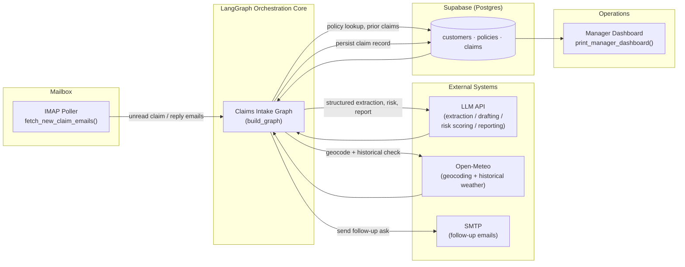
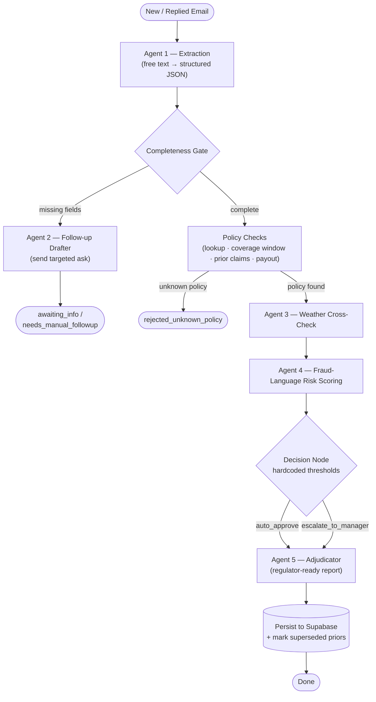
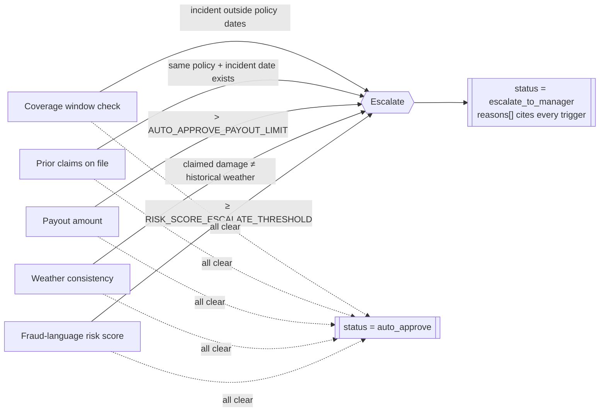
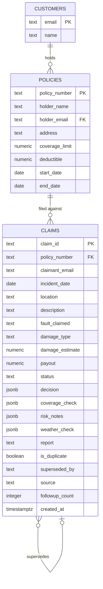

# FNOL Claims Intake Agent

**Multi-agent LangGraph pipeline for automated auto-insurance claim intake, triage, and adjudication.**

[]()
[]()
[]()
[]()
[]()

---

## Overview

**FNOL** — *First Notice of Loss* — is the industry term for the moment a policyholder first reports an incident to their insurer. This notebook implements a **production-grade, agentic FNOL intake system**: it watches a real mailbox, reads claim emails as they arrive, and runs each one through a graph of specialist agents that extract the facts, verify the policy, cross-check the weather, screen the language for fraud risk, and either auto-approve or escalate the claim to a human adjuster — with a full, regulator-ready report attached.

There is no mock mode. Every node talks to a live system (LLM API, Supabase, IMAP/SMTP, Open-Meteo), and the notebook **fails fast at startup** if a required credential is missing rather than silently degrading to fake data.

| Piece | Backing system |
|---|---|
| LLM calls (extraction, drafting, risk scoring, reporting) | Live OpenAI-compatible endpoint (default: Gemini 2.0 Flash) |
| Claim / policy / customer storage | Supabase (Postgres) |
| Inbound claim emails | Real IMAP mailbox (unread-message polling) |
| Outbound follow-up emails | Real SMTP send |
| Weather corroboration | Open-Meteo geocoding + historical archive API |

---

## Table of Contents

1. [Architecture](#architecture)
2. [Agent Roster](#agent-roster)
3. [Claim Lifecycle](#claim-lifecycle)
4. [Decision Logic](#decision-logic)
5. [Data Model](#data-model)
6. [Project Structure](#project-structure)
7. [Getting Started](#getting-started)
8. [Configuration Reference](#configuration-reference)
9. [Running the System](#running-the-system)
10. [Manager Dashboard](#manager-dashboard)
11. [Duplicate & Supersession Handling](#duplicate--supersession-handling)
12. [Reliability & Failure Handling](#reliability--failure-handling)
13. [Production Deployment Notes](#production-deployment-notes)
14. [Security Considerations](#security-considerations)

---

## Architecture

The system is a closed loop: an IMAP poller feeds raw emails into a compiled LangGraph state machine, which fans out to external services (LLM, Supabase, Open-Meteo, SMTP) and writes its final, structured decision back to Postgres for a manager dashboard to consume.



---

## Agent Roster

The graph is composed of five LLM-backed agents and three deterministic (hardcoded, non-AI) nodes. Keeping policy math, coverage windows, and approval thresholds **out of the LLM's hands** is a deliberate design choice — those decisions must be auditable and reproducible.

| # | Node | Type | Responsibility |
|---|---|---|---|
| 1 | `extraction_agent` | 🤖 LLM | Parses the raw claim email into structured JSON: policy number, incident date, location, description, fault claimed, damage type. |
| — | `completeness_gate` | ⚙️ Deterministic | Checks the extracted claim against `REQUIRED_CLAIM_FIELDS`; routes to follow-up if anything is missing. |
| 2 | `followup_agent` | 🤖 LLM | Drafts and sends a targeted "please send more details" email. Bails out to `needs_manual_followup` after `MAX_FOLLOWUP_ATTEMPTS`. |
| — | `policy_checks_node` | ⚙️ Deterministic | Looks up the policy in Supabase, checks the coverage window, searches for prior claims on the same policy + incident date, calculates payout. |
| 3 | `weather_agent` | 🤖 Tool-calling | Geocodes the claimed location and cross-checks the claimed damage type against real historical weather for that date. |
| 4 | `risk_language_agent` | 🤖 LLM | Scores the claim narrative (0.0–1.0) for suspicious phrasing or internal inconsistency, without accusing anyone of fraud outright. |
| — | `decision_node` | ⚙️ Deterministic | Combines every specialist's output against hardcoded thresholds to reach `auto_approve` or `escalate_to_manager`. |
| 5 | `adjudicator_agent` | 🤖 LLM | Writes the final regulator-ready report summarizing every check performed, its data source, and the decision rationale. |

---

## Claim Lifecycle

Every claim moves through the same compiled graph, with two exit ramps: **incomplete claims** stop for a human-facing follow-up email, and **claims tied to an unknown policy** are rejected outright. Everything else runs the full specialist gauntlet before reaching a decision.



---

## Decision Logic

`decision_node` is intentionally **hardcoded and deterministic** — it reads every specialist's output but never calls an LLM itself, so the approve/escalate call is always reproducible and auditable. A claim is escalated to a human the moment **any one** of these conditions is true:



If a claim escalates, **every** triggering reason is recorded in `decision.reasons` — not just the first one hit — so a human reviewer sees the complete picture in one read.

---

## Data Model

Three tables in Supabase / Postgres back the entire system. There is no in-memory fallback anywhere in the codebase — every read and write goes through these tables.



Run the schema once via **Supabase → Project → SQL Editor → New query** before first use — the notebook only ever reads and writes rows; it never provisions tables or seeds sample data.

---

## Project Structure

The system ships as a single production notebook, organized top-to-bottom in execution order:

```
FNOL_Claims_Intake_Agent_LangGraph_v3_PRODUCTION.ipynb
│
├── Imports + logging
├── Config                       # eager env-var validation, fails fast on missing creds
├── Supabase schema (SQL)        # one-time manual setup step
├── LLM helper                   # single choke point for every model call, with retries
├── Database layer               # lookup_policy · check_coverage_window · find_prior_claims
├── Weather cross-check          # Open-Meteo geocoding + historical archive
├── Shared graph state           # ClaimState (TypedDict)
├── Agent 1 — Extraction
├── Completeness gate
├── Agent 2 — Follow-up drafter
├── Policy checks node
├── Agent 3 — Weather-consistency agent
├── Agent 4 — Suspicious-language / fraud-risk agent
├── Decision node
├── Agent 5 — Adjudicator / report writer
├── Build the graph               # build_graph() → compiled StateGraph
├── Orchestration helpers         # process_claim · resume_claim · print_review_queue
├── Structured claim view + manager dashboard
├── IMAP inbox intake             # fetch_new_claim_emails · process_inbox
├── Graph visualization           # Mermaid PNG render of the compiled graph
├── Continuous polling loop       # run_once · run_forever
└── Deployment notes
```

---

## Getting Started

### Prerequisites

- Python 3.10+
- A Supabase project (Postgres)
- An OpenAI-compatible LLM endpoint and API key
- A mailbox with IMAP and SMTP access (an **app password**, not your login password, if using Gmail)

### 1 — Provision the database

Open **Supabase → SQL Editor → New query** and run the schema from the [Data Model](#data-model) section (full SQL is embedded in the notebook's "Supabase schema" cell). This is the only manual setup step. Load real customers and policies through your own onboarding process — the system does not seed sample data.

### 2 — Install dependencies

```bash
pip install langgraph openai supabase requests python-dotenv
```

### 3 — Configure environment variables

Create a `.env` file (or export the variables directly) — see the [Configuration Reference](#configuration-reference) below for the full list.

### 4 — Run

Open the notebook and run all cells top to bottom. The final cell calls `run_forever()`, which polls the configured mailbox continuously.

---

## Configuration Reference

Every variable marked **Required** is validated **eagerly at import time** — the notebook raises a `RuntimeError` immediately if any is missing, instead of running with partial or fake behavior.

| Variable | Required | Default | Purpose |
|---|:---:|---|---|
| `LLM_API_KEY` | ✅ | — | API key for the LLM endpoint |
| `LLM_BASE_URL` | | `https://generativelanguage.googleapis.com/v1beta/openai/` | OpenAI-compatible base URL |
| `LLM_MODEL` | | `gemini-2.0-flash` | Model identifier |
| `SUPABASE_URL` | ✅ | — | Supabase project URL |
| `SUPABASE_KEY` | ✅ | — | Supabase `service_role` API key |
| `SMTP_HOST` | | `smtp.gmail.com` | Outbound mail server |
| `SMTP_PORT` | | `587` | Outbound mail port |
| `SMTP_USER` | ✅ | — | SMTP account username |
| `SMTP_PASSWORD` | ✅ | — | SMTP app password |
| `IMAP_HOST` | | `imap.gmail.com` | Inbound mail server |
| `IMAP_PORT` | | `993` | Inbound mail port |
| `IMAP_USER` | ✅ | — | IMAP account username |
| `IMAP_PASSWORD` | ✅ | — | IMAP app password |
| `IMAP_MAILBOX` | | `INBOX` | Mailbox folder to poll |
| `AUTO_APPROVE_PAYOUT_LIMIT` | | `1500.0` | Payout ceiling for automatic approval |
| `RISK_SCORE_ESCALATE_THRESHOLD` | | `0.3` | Fraud-language score that forces escalation |
| `MAX_FOLLOWUP_ATTEMPTS` | | `3` | Automated info-requests before handing off to a human |
| `POLL_INTERVAL_SECONDS` | | `60` | Inbox polling cadence for `run_forever()` |

---

## Running the System

| Function | Purpose |
|---|---|
| `process_claim(raw_email_text, claimant_email, damage_estimate, source)` | Runs a single new claim through the graph and persists the result. Auto-generates a `CLM-XXXXXXXX` claim ID. |
| `resume_claim(claim_id, followup_email_text, damage_estimate)` | Re-enters the graph for an existing claim with the customer's follow-up reply; **updates** the existing row rather than inserting a new one. |
| `run_once()` | Polls the inbox once, runs every new/replied message through the graph, logs the outcome. |
| `run_forever(poll_interval)` | Wraps `run_once()` in a loop on a fixed interval. A single failed poll cycle is logged with a full traceback and does **not** crash the process. Exits cleanly on `Ctrl+C` / Kernel Interrupt and prints the final manager dashboard. |
| `print_review_queue()` | Lists every claim currently `awaiting_info`, `escalate_to_manager`, or `needs_manual_followup`. |
| `print_claim(claim_id)` | Renders one claim as a formatted card, straight off its Supabase row. |
| `print_manager_dashboard(detailed=True)` | Full operational snapshot — see below. |

Inbound mail is fetched with `BODY.PEEK[]`, so a message is **never marked read until it has been successfully processed** — a mid-run crash can't silently lose an email. Every unseen message runs through a two-stage filter: it's first checked against open claims for a thread match (by the `[CLM-XXXXXXXX]` tag stamped into every follow-up subject line), and only started as a **new** claim if it actually reads as insurance-related — so a newsletter or unrelated reply never spawns a spurious claim.

---

## Manager Dashboard

`print_manager_dashboard()` gives a manager exactly three things to look at:

| Section | Contents |
|---|---|
| **Still waiting on the customer** | Claims stuck in the automated info-request loop (`awaiting_info`). |
| **Escalated to you** | Needs a human decision — includes both risk/coverage escalations and claims that exhausted `MAX_FOLLOWUP_ATTEMPTS` (`escalate_to_manager`, `needs_manual_followup`). |
| **Auto-approved by the system** | FYI only — no action needed. |

Pass `detailed=True` to expand every row into its full claim card instead of a one-line summary. The dashboard is printed automatically whenever `run_forever()` is interrupted.

---

## Duplicate & Supersession Handling

The system never silently merges or silently drops a possible duplicate claim. `find_prior_claims` looks for any other **still-active** claim (`superseded_by IS NULL`) on the same policy number and incident date and returns it — without judgment. `decision_node` then treats a non-empty result as an automatic escalation trigger, naming the prior claim ID(s) explicitly in `decision.reasons`. Once the graph completes, `_persist_result` flips the prior claim's `status` to `superseded` in the database.

**Both records are preserved.** Only one claim is ever "active" for a given policy + incident date at a time, but the full history stays queryable.

---

## Reliability & Failure Handling

- **Fail-fast configuration** — every required credential is checked at import time; a half-configured deployment never starts.
- **LLM retries** — `call_llm()` is the single choke point for every model call in the system, with configurable retry attempts and warning-level logging on each failed attempt before it ultimately raises.
- **Crash-safe inbox reads** — unread emails are only marked seen after successful processing.
- **Isolated poll failures** — `run_forever()` logs a full traceback on a failed cycle and retries on the next interval rather than terminating the process.
- **Graceful shutdown** — `Ctrl+C` / Kernel Interrupt is caught, the loop exits cleanly, and the final manager dashboard is printed so nothing is left unaccounted for.
- **Anti-nagging follow-up loop** — after `MAX_FOLLOWUP_ATTEMPTS` unanswered info requests, the system stops auto-emailing the customer and hands the claim to a human instead.

---

## Production Deployment Notes

1. **Supabase** — create a project, run the schema in the SQL editor, and provide `SUPABASE_URL` / a `service_role` `SUPABASE_KEY`. Load real customers and policies through your own onboarding process.
2. **LLM** — set `LLM_API_KEY` (and `LLM_BASE_URL` / `LLM_MODEL` if not using the defaults).
3. **Email sending** — `SMTP_USER` / `SMTP_PASSWORD` (an app password).
4. **IMAP intake** — `IMAP_USER` / `IMAP_PASSWORD` (app password) and `IMAP_HOST` if not on Gmail.
5. All of the above are required; the config cell raises immediately if anything is missing.
6. For a true production rollout, export the notebook to a script with `jupyter nbconvert --to script`, and trigger `run_once()` on a schedule (cron / systemd timer / Airflow) rather than leaving a notebook cell running interactively.

---

## Security Considerations

- Keep the Supabase **service key** and every other credential in a secrets manager — never in a plaintext `.env` file in a production environment.
- IMAP/SMTP credentials should be **app passwords**, scoped and revocable independently of the primary account login.
- The fraud-language agent is intentionally conservative: it surfaces a **risk score and notes for human review**, and never issues an outright fraud accusation.
- All decision thresholds (`AUTO_APPROVE_PAYOUT_LIMIT`, `RISK_SCORE_ESCALATE_THRESHOLD`, `MAX_FOLLOWUP_ATTEMPTS`) live in configuration, not code, so they can be tuned per deployment without a redeploy.

---

<p align="center"><sub>Built on LangGraph · Supabase · IMAP/SMTP · Open-Meteo</sub></p>
